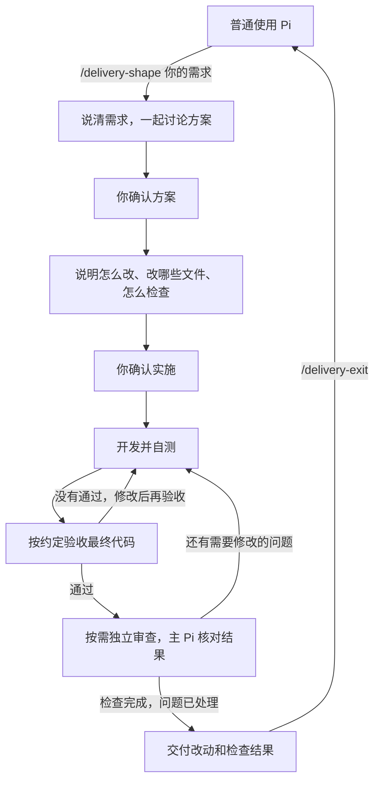
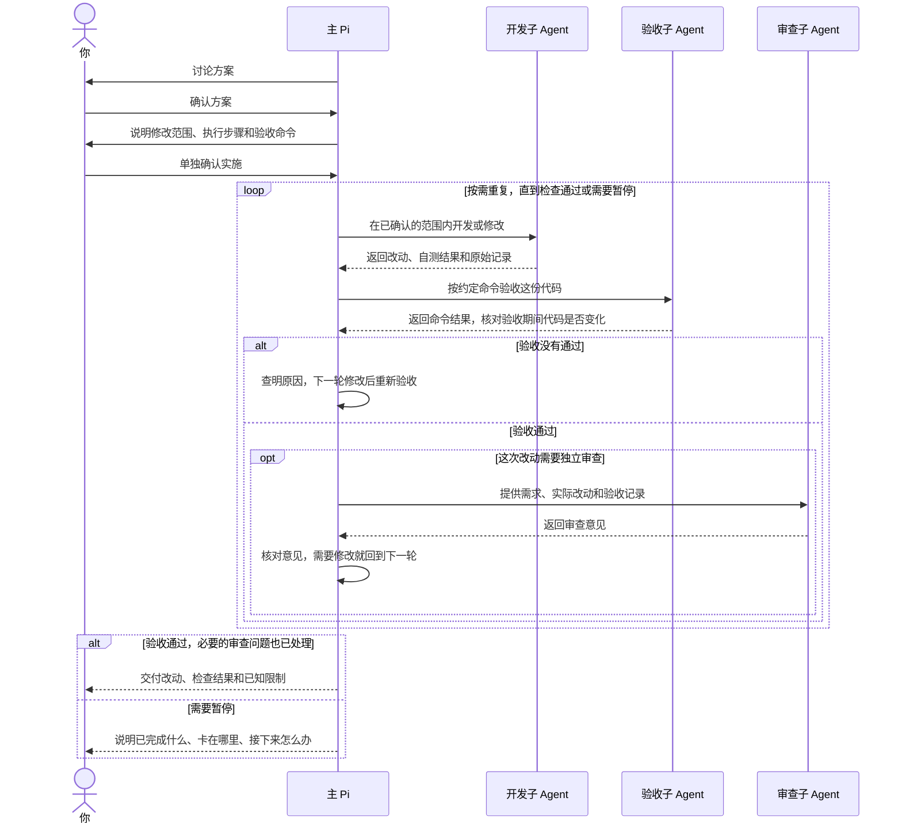

# Pi Adaptive Delivery

**让 Pi 先和你商量清楚，再动手开发，最后拿出检查结果。**

这是一个 Pi 扩展包。你决定要做什么、允许改哪里，Pi 负责组织开发、检查，并按需要安排另一个 AI 审查代码。适合需要先讨论方案、明确修改范围，并查看实际检查结果的项目任务。

**安装后默认不开启交付流程，日常照常使用 Pi。** 输入 `/delivery-shape 你的需求` 才进入；任务结束后用 `/delivery-exit` 退出。简单任务可以只在聊天中写清方案和步骤，不必专门创建技术方案和实施计划文件。

**进入交付后，查资料、联网、改文件和运行命令仍用 Pi 原来的工具。** 子 Agent 跟随主 Pi 已启用的工具和原有权限检查，这个包不另外禁网，也不按角色删减普通工具。

[完整流程](#完整流程) · [快速开始](#快速开始) · [协作时序](#协作时序) · [命令速查](#命令速查)

## 完整流程

图里的“验收”，就是按你事先确认的命令，检查最后改好的那份代码。代码如果又改过，就要重新验收。



你主要参与两次不同的决定。例如，修复“空列表导致页面报错”：

| 确认 | 要决定什么 | 示例 |
|---|---|---|
| **方案确认** | 这个需求要怎么解决 | 没有数据时显示空状态，有数据时保持原样，本次不改接口 |
| **实施确认** | 允许改哪些文件，怎么检查 | 修改列表组件和测试，在本机运行项目的测试命令 |

需求清楚时直接整理方案；还有关键问题时，每次只问一件事。你可以反复提意见、改方案，再在 Pi 界面里分别确认方案和实施。确认后 Pi 继续下一步，不必反复输入“继续”。

确认界面先展示这次怎么改。用 ↑↓ 选择操作、Enter 确定，Ctrl+O 查看详情，PgUp/PgDn 翻页。想改方案时，选择“提出修改意见”再输入；Enter 发送，Shift+Enter 换行，Esc 返回方案。实施确认会列出允许修改的范围和实际验收命令。

**需要长期查阅或持续跟踪进度时，再写文档。** 项目已有相关方案和进度记录时，按项目规则继续维护，避免另建一套。没有规划文件的小任务，方案、步骤和检查记录都留在会话里。

## 快速开始

目前通过本地路径试用，还没有发布到 npm。你只需要已配置模型的 Pi 和一个 Git 项目。**开发和测试直接在本机运行，不需要 Docker 或镜像。** 项目原本需要的 Node、Python、Java 等工具和依赖，继续使用你本机已有的环境。

1. 获取本仓库：

   ```sh
   git clone https://github.com/small-xiexu/pi-adaptive-delivery.git
   ```

2. 在**你要修改的项目**的 `.pi/settings.json` 中，把本仓库的绝对路径加入 `packages`。下面的路径需要替换；已有配置和其他扩展包要保留：

   ```json
   {
     "packages": ["/absolute/path/to/pi-adaptive-delivery"]
   }
   ```

3. 在你要修改的项目中启动 Pi：

   ```sh
   cd /path/to/your-project
   pi
   ```

   按 Pi 提示确认项目信任，然后输入需求：

   ```text
   /delivery-shape 修复空列表导致页面报错，保持正常列表行为不变
   ```

   也可以先输入 `/delivery-shape`，再直接聊天描述需求。如果 Pi 已经开着，等当前任务结束后用 `/reload` 加载扩展包。

目前验证过的组合是 **macOS、Pi 0.85.1、Node 25.2.1**，其他平台和版本还没验证。使用 `pi-codex-conversion` 的用户，先按 [Structured 接入说明](docs/技术方案.md)（第 14.2 节）配置加载顺序。

## 协作时序

“主 Pi”就是你正在对话的 Pi。它负责和你讨论、分配任务、核对结果，再把开发、验收和审查交给不同的子 Agent，也就是在独立会话里工作的 AI。这些会话都在本机工作，交付任务按顺序交接。验收要求运行约定的命令，审查要求只分析、不改代码；子 Agent 不能代替你确认方案或允许改动的范围。

**主 Pi 用什么模型，子 Agent 就用什么模型。** AI 只按任务难度调整推理级别，不会自行换成别的模型；你切换主 Pi 的模型后，新任务跟着切换，正在执行的任务保持原样。



开发者自测之后，仍要单独验收，确保测试的是最终这份代码。审查发现的问题由主 Pi 核对处理；原来约定范围内的问题可以继续修，想多改其他地方或更换验收要求，就要重新请你确认。缺少环境、权限或无法确认执行结果时，会暂停并说明原因。提交、推送和发布也要另行取得你的授权。

## 命令速查

全部 7 个交付命令都在这里，`status` 的详情用法单独列了一行。`[内容]` 可以省略，输入时不用带方括号。

| 命令 | 做什么 | 什么时候用 |
|---|---|---|
| `/delivery-shape [需求]` | 进入交付并讨论需求；不带需求时只开启流程 | 等当前回复、工具执行和排队消息结束后使用 |
| `/delivery-plan [补充要求]` | 请 Pi 整理怎么改、改哪里、怎么检查，再请你确认 | 已进入交付、方案已确认时；可选 |
| `/delivery-run [补充要求]` | 请 Pi 核对本轮授权，继续开发、检查和必要的修改 | 已进入交付、实施已确认时；可选 |
| `/delivery-status` | 看当前确认或执行阶段、下一步建议及运行任务 | 进入前后都能查 |
| `/delivery-status details` | 进一步查看写入记录和原始子会话位置，帮助排查问题 | 进入交付后查看详情；未进入时只提示当前状态 |
| `/delivery-tasks [任务ID]` | 选择子任务、看实时输出；带 ID 时直接打开对应详情 | 进入交付后，在主 Pi 终端查看当前会话分支的任务 |
| `/delivery-resume` | 继续看当前会话分支里最近尚未确认的方案 | 进入交付后、主 Pi 空闲时；只继续讨论，不会自动开始开发 |
| `/delivery-exit` | 退出并重载，恢复原工具和进入前启用的工具列表 | 等执行结束、写入权限交回；还不能退出时会说明原因 |

**不必把这些命令按顺序输一遍。** 进入后，主 Pi 会按流程推进，需要你确认时再提示。`/delivery-plan` 和 `/delivery-run` 只是方便你主动推进的提示，不会自行开启交付，也不能代替两次确认。

命令入口在加载扩展包时就会出现在补全列表里。**子任务执行时也能用 `/delivery-tasks` 查看，不需要等它结束或重载。** 全屏模式下还可以点击任务卡片；未进入交付时，查看任务或继续审阅只会提示先使用 `/delivery-shape`。

你仍可以在主 Pi 终端输入 `!命令` 运行 Shell；`!!命令` 也会执行，但输出不会交给模型。你手动运行命令，不会因此给 AI 增加权限，结果也不算这套流程的验收记录。

暂停和重新打开时，记住这几件事：

- **暂停看方案：** 在方案页选择“稍后再看”或按 Esc，之后可以直接提意见，或用 `/delivery-resume` 继续。输入意见时，Esc 先返回方案页。
- **关闭子任务详情：** 按 Esc 只关窗口，任务还会继续。
- **重载或重开原会话：** `/reload` 会重载扩展；交付流程仍然开启，但旧批准和验收不能直接沿用，开发前需要重新确认。新建普通会话则默认不开启交付。

退出交付只表示回到普通使用，不代表任务已经验收通过。

## 当前边界与进一步阅读

历史版本已有真实模型在隔离环境中完成命令行工具开发、审查、修复和交付的案例；这些不能直接当作当前版本的验证结果。最新状态和证据入口统一见[实施计划首页](docs/实施计划.md)。**实际终端用起来是否顺畅、AI 是否会给小任务多写文档、完整业务项目能否顺利交付，还需要继续试用验证。**

这套流程核对自己的批准、任务交接和验收证据，**不会接管普通工具的权限**。修改范围和“审查不改代码”仍需 AI 遵守，不能据此保证任何工具都无法越界或同时写文件。原插件自己的拒绝仍有效；后台进程由原工具和项目脚本负责，交付包不保证它们全部停止。子会话按配置重建工具，无法复制的临时插件能力会明确报错；退出时也不保证其他插件的内部状态全部还原。

| 需要了解 | 阅读 |
|---|---|
| 本机工具和 Structured 配置 | [接入说明](docs/技术方案.md)（第 14 节） |
| 为什么要确认两次，怎样避免 AI 同时改文件 | [确认与写入控制](docs/技术方案.md)（第 8 节） |
| 怎么检查代码，发现问题后怎么修 | [验收、审查与返工](docs/技术方案.md)（第 10 节） |
| 中断后怎样查看记录、继续处理 | [进度与中断恢复](docs/技术方案.md)（第 11 节） |
| AI 的具体协作规则与推理级别 | [adaptive-delivery Skill](skills/adaptive-delivery/SKILL.md) |
| 目前做到了哪一步，有哪些实际案例和测试记录 | [实施计划](docs/实施计划.md) |
| 本地运行项目测试 | [开发验证](docs/技术方案.md)（第 14.3 节） |

本项目基于标准 Pi 的公开 API，不依赖或包装 `pi-subagents`。
