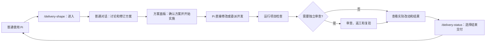

# Pi Adaptive Delivery

**让 Pi 按“先确认、再修改、后检查”的方式完成开发任务。**

这是一个给 Pi 增加交付流程的扩展包。你说明需求和允许修改的范围，Pi 先整理方案并等待确认；确认后再修改代码、运行项目已有检查，并在需要时安排独立审查。

日常操作只需要两个交付命令：`/delivery-shape` 进入，`/delivery-status` 查看和处理状态。方案讨论、修改意见和中断后的继续，都可以直接用普通对话表达。

**版本说明：本文介绍 Git `main` 源码中的两个入口新交互，尚未发布到 npm。已发布的 npm `0.1.16` 仍使用此前的命令入口；按本文流程使用时，请选择下面的 Git 源码安装方式。**

## 先判断是否需要交付流程

小改动、低风险、范围明确的任务，可以继续直接使用普通 Pi。涉及多个文件、业务行为、接口、权限、迁移、复杂测试，或需要独立检查时，再输入 `/delivery-shape`。

确认方案后，Pi 会根据任务复杂度选择执行方式：父 Pi 直接完成简单任务，复杂任务才委派开发子 Agent，高风险任务按需安排独立审查。用户不需要为每个步骤、返工或子任务再次确认。

普通 Pi 使用不受影响。安装后不会自动进入交付流程，只有输入 `/delivery-shape` 才会开始。

## 需要交付时怎么使用

| 命令 | 用途 |
|---|---|
| `/delivery-shape [需求]` | 进入交付流程；可以直接带上需求 |
| `/delivery-status` | 查看摘要和详情；只有满足结束条件时提供结束交付 |

整个过程可以理解为五步：

1. 输入 `/delivery-shape`，在同一条消息或之后的普通对话中描述问题。
2. Pi 核对项目事实，整理方案、范围和验收方式；你直接提出修改意见。
3. 在方案面板中选择“确认方案并开始实施”。需要修改时选“提出修改意见”，暂缓时选“稍后再看”。
4. 确认后 Pi 自动衔接实施：完成简单任务，或委派复杂任务，再运行检查和必要的审查。你无需逐步输入推进命令。
5. 核对实际改动和检查结果；需要回到普通 Pi 时，输入 `/delivery-status` 并选择“结束交付”。


```mermaid
flowchart LR
    A["普通使用 Pi"] --> B["/delivery-shape：进入"]
    B --> C["普通对话：讨论和修订方案"]
    C --> D["方案面板：确认方案并开始实施"]
    D --> E["Pi 直接修改或委派开发"]
    E --> F["运行项目检查"]
    F --> G{"需要独立审查?"}
    G -->|是| H["审查、返工和复验"]
    G -->|否| I["查看实际改动和结果"]
    H --> I
    I --> J["/delivery-status：选择结束交付"]
    J --> A
```

例如，你可以输入：

```text
/delivery-shape 修复空列表导致页面报错，保持正常列表行为不变
```

Pi 会先说明目标、数据行为、技术路径和验收方式。你可以直接说“补上空列表和正常列表的测试，其他行为保持不变”，让 Pi 修订方案。最终授权实施仍由方案面板中的明确确认产生。

## 重要边界

**这不是安全沙箱。** 开发和审查子 Agent 会继承当前 Pi 已启用的普通工具和原有权限检查，包括：

- 读取和修改文件
- Shell 和项目命令
- 联网能力
- 其他已加载的 Pi 插件工具

审查子 Agent 也不会被 Package 自动禁用 `write` 或 `edit`。开发和审查的区别来自任务职责：开发负责实现，审查负责检查和报告问题。Package 负责方案确认、任务交接、检查证据和恢复状态，不负责限制普通工具权限，也不能保证项目后台进程全部停止。

项目本身需要的 Node、Python、Java、数据库或其他依赖，仍由项目和本机环境负责。Package 不自动安装依赖、不修改项目运行环境，也不把工具名称存在当成项目检查一定能通过。

## 安装和快速开始

npm 安装适合使用已发布的 Package；Git 源码安装可使用本文的两个入口交互，也适合开发和调试。两种方式的安装步骤如下。

### 方式一：安装已发布的 npm Package

在你要使用 Package 的项目中执行：

```sh
pi install npm:pi-adaptive-delivery -l
```

然后启动 Pi：

```sh
cd /path/to/your-project
pi
```

项目级安装会在项目中生成 `.pi/settings.json`，其中声明了 Package。这个文件应纳入项目版本控制；`.pi/npm/` 下由 npm 生成的 `node_modules`、`package.json` 和锁文件通常由 npm 的 `.gitignore` 排除，不要提交。

如果使用全局安装，所有项目都会加载这个 Package：

```sh
pi install npm:pi-adaptive-delivery
```

卸载项目级 Package：

```sh
pi remove npm:pi-adaptive-delivery -l
```

### 方式二：使用本地源码

获取源码仓库：

```sh
git clone https://github.com/small-xiexu/pi-adaptive-delivery.git
```

然后在**你要修改的项目**的 `.pi/settings.json` 中加入本地仓库绝对路径，并保留已有配置和其他扩展包。仓库 `main` 已包含本文的两个入口交互，新克隆的工作副本即可使用。

```json
{
  "packages": [
    "/absolute/path/to/pi-adaptive-delivery"
  ]
}
```

本地 Package 目录本身需要有 Pi 能加载的扩展资源。进入目标项目后启动 Pi：

```sh
cd /path/to/your-project
pi
```

无论使用哪种安装方式，都需要：

- 已配置可用模型的 Pi
- 一个 Git 项目
- 项目本身已有的运行依赖和检查命令

Package 不要求 Docker 或镜像。项目检查直接使用本机工具链。

### 启动和重载

如果 Pi 已经开着，安装 Package 或修改 `.pi/settings.json` 后，等当前任务收尾，再输入：

```text
/reload
```

进入交付流程：

```text
/delivery-shape
```

你也可以直接带上需求：

```text
/delivery-shape 修复登录超时后页面一直显示加载中的问题
```

## 方案确认和实施方式

Pi 会根据任务复杂度选择实施方式：

- **简单任务：** 当前 Pi 在已确认范围内直接修改和检查。
- **复杂任务：** 独立开发子 Agent 修改代码，完成后把结果交回父 Pi。
- **需要第二视角的任务：** 独立审查子 Agent 读取当前改动、运行检查并报告问题。

你通常只需要确认一次方案。在已确认的目标和边界内，Pi 可以调整文件数量、步骤、执行顺序和检查命令，修复失败并安排返工，无需再确认一份实施计划。以下变化需要暂停受影响工作并重新确认：

- 改变业务目标或数据行为
- 超出已确认的任务边界或操作权限
- 改变对外接口或验收标准
- 引入未覆盖的重大外部风险

需要长期查阅或持续跟踪进度时，方案可以写入项目 Markdown 文档；简单任务也可以只保留在当前会话中。审阅界面先显示本次方案正文：开头概括修改和效果，再展开范围、设计及验收。文档安排使用简短说明，具体路径、工作目录和记录标识放在 `Ctrl+O` 详情中；宽屏正文最多使用 100 列，长内容可翻页查看。工具卡片默认显示中文摘要，展开保留完整参数和返回正文。

重载、切换会话或分支导航后，旧实施确认不会自动恢复；存在旧确认记录时，审阅界面会明确提示需要重新确认。核对已有方案和现场后即可重新提交，不必重复讨论已明确的需求。

落盘方案在确认前必须确实写入指定的 Markdown 文件。文件不存在、为空或不是普通文件时，Package 会拒绝确认并提示先完成文档写入。不落盘的方案会明确说明内容只保存在当前会话。

## 暂停后怎么继续

| 当前情况 | 你可以怎么表达 | Pi 接下来做什么 |
|---|---|---|
| 还在讨论方案 | 直接说明需求或修改意见 | 核对事实并修订同一方案 |
| 在方案面板选择了“稍后再看” | “继续看方案”或直接提出意见 | 读取已有方案和意见，形成当前审阅提案，等待确认 |
| 实施中断，想接着完成 | “继续，先核对已完成工作和原执行状态” | 核对进度、实际改动及执行收尾；确认仍有效时在原范围继续 |
| 重载或重开会话后继续 | “继续上次的任务” | 核对能取得的原始方案、记录和现场，重新提交必要的方案确认 |

正常确认后 Pi 会自动衔接实施，你无需为每个步骤说“继续”。中断后，普通对话表达的是继续意图，不会自动生成批准、清除占用或重放未知执行。旧确认失效时需要重新确认已有方案，已经明确的需求无需重新访谈；记录不足时，Pi 会说明实际缺口。自然语言理解依赖当前模型，运行时仍核验真实确认与执行收尾。

## 状态、继续和结束交付

输入 `/delivery-status` 打开轻量状态面板。正文只显示当前阶段、下一步和运行中任务；`Ctrl+O` 展开 lease、PID、Session、执行路径和收尾核验等技术详情。状态页没有任务选择和解锁入口，翻页、查看详情或直接按 Enter 都不会结束交付；只有先用方向键选中“结束交付”，再按 Enter 才会执行。

说“继续”时，父会话先核对当前方案确认、回合、在途任务和同 worktree 的 lease。能够同时证明原任务已结束、持久收尾完整、父结果唯一落盘、workspace/owner/lease ID 完全匹配的已知失败，会自动清理同一残留并写入 `delivery-unlock` 审计，然后继续当前方案。进程被强杀、扩展异常、记录不完整、lease ID 不匹配或归属无法核实时，只显示一次“恢复交付”面板；选择“暂不处理”保留现场，选择“清理残留并继续”也不会恢复旧批准或把未知执行当成成功。

恢复发生在本轮方案确认核验之后。清理只移除已核对的 lease/操作锁并保留已有代码和原始 Session；它不重放未知任务、不恢复失效确认，也不代表检查或审查通过。状态页只有在回合空闲、没有排队消息、没有在途任务、writer 已交回且没有残留占用时显示“结束交付”。

本版对外只保留以上两个命令，原规划、推进、恢复、任务、解锁和退出命令已删除，不提供旧命令别名。

## 任务状态和检查结果

任务详情只显示 Package 能从原始记录中核实的事实：

- 当前任务是否仍在运行
- 子 Session 是否创建
- 子任务实际执行了哪些工具
- 工具是否返回错误
- 子进程是否正常退出
- 原始 Session 是否完整保存
- writer 是否已经交回
- 检查或审查是否因为改动变化而失效

交付结果固定说明四类信息：

```text
修改内容：实际改了什么
检查命令：运行了什么、退出码是什么、结论是什么
独立审查：是否执行、发现什么、哪些问题已处理
限制和未执行项：哪些内容没有验证或仍需关注
```

没有运行检查时，会明确写“未运行”；子任务显示“已完成”也只表示子任务正常收尾，不等于业务目标或项目检查已经通过。

子进程通信或事件处理失败时，工具返回和原始会话会保留具体原因；扩展报错同时保留来源路径与事件名称。后续收尾错误会追加到原始错误之后，收尾无法核实时仍保留写入记录，可通过状态面板核对并按前面的继续说明处理。

代码发生新的修改后，之前的检查结果不能自动证明当前代码仍然通过，通常需要重新检查。审查是独立意见，不会代替用户确认，也不会自动扩大修改范围。

## 普通 Shell 和暂停操作

你仍可以在主 Pi 终端执行手动 Shell：

```text
!命令
!!命令
```

`!` 和 `!!` 沿用 Pi 原生行为。手动执行的命令不会自动获得交付批准，也不会被 Package 当成正式检查证据。

方案面板默认选择“稍后再看”，支持以下操作：

- ↑↓ 选择操作，Enter 确认
- Ctrl+O 查看完整详情
- PgUp/PgDn 翻页
- 选择“提出修改意见”后，Enter 提交意见，Shift+Enter 换行
- 在意见输入状态按 Esc 返回方案正文；在正文状态按 Esc 暂停审阅

子任务详情中按 Esc 只关闭详情窗口，任务仍会继续。

如果模型长时间没有内容增量，交付流程会在默认 120 秒后中断本次请求并自动继续，每个回合最多自动恢复两次。工具执行期间不计入这个停顿时间，因此长时间运行的项目命令不会被误判。这个机制只在交付流程中生效，普通 Pi 会话仍由 Pi 自己处理停顿。

## 兼容性和当前边界

方案确认和结束交付面向 Pi 的交互式终端。非 TUI 模式的 `/delivery-status` 只返回可读取的状态详情；恢复选择仍拒绝执行，结束交付也不提供操作。

当前自动化验证过的基础组合是：

- macOS
- Pi `1.1.0`
- Node `25.2.1`

其他 Pi 版本、操作系统、第三方插件组合和真实模型质量没有在本轮完整验证。升级 Pi 后，应重启已经运行的父 Pi；标准 Pi 启动子任务时会优先复用父进程当前的 CLI 入口，避免父进程 PATH 变化后混用另一份 Pi。嵌入 SDK 没有可复用入口时才按 PATH 查找工作区外的标准 CLI，此时仍需要保证宿主 SDK 和找到的 CLI 版本一致。

Package 在子插件启动结束后再次承接父本轮明确选择的工具列表，再核对父子工具定义、工具来源、系统指令、规则和 Skills，避免动态启用插件将初始列表重置。工具实际未注册、配置禁用或环境仍无法对齐时，任务不会发送。

本 Package 不依赖或包装 `pi-subagents`，不修改 Pi 安装目录，不提供第二套 Agent runtime，也不接管普通工具的权限系统。

## 进一步阅读

| 想了解什么 | 阅读 |
|---|---|
| 本机工具、配置和验证方式 | [技术方案：本机接入与开发验证](docs/技术方案.md#section-14) |
| 为什么需要先确认方案、怎样进入流程 | [技术方案：方案对齐与主流程](docs/技术方案.md#3-已对齐的主流程) |
| 怎样检查、审查和返工 | [技术方案：验收、审查与返工](docs/技术方案.md#section-10) |
| 中断后怎样恢复 | [技术方案：进度与中断恢复](docs/技术方案.md#section-11) |
| AI 的协作规则和推理级别 | [adaptive-delivery Skill](skills/adaptive-delivery/SKILL.md) |
| 当前进度、版本和实际验证记录 | [实施计划](docs/实施计划.md#section-13) |
| pi-better-compaction 0.6.0 的 Pi 1.1.0 修复补丁 | [插件兼容修复](docs/插件兼容修复.md) |

实现基于 Pi 的公开 API，使用本机项目权限和工具环境，不把 Package 当作安全沙箱或项目依赖管理器。
